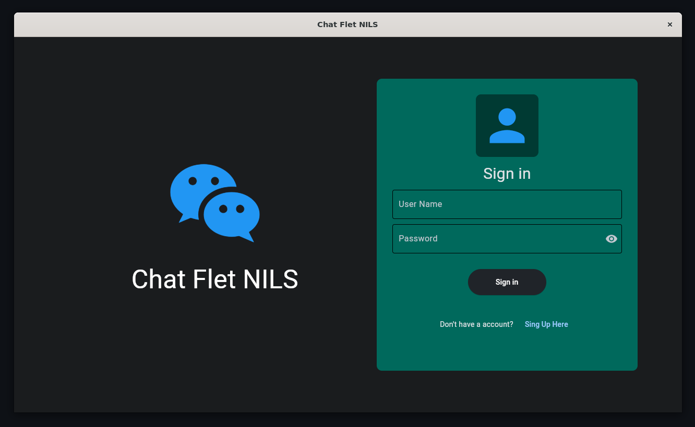
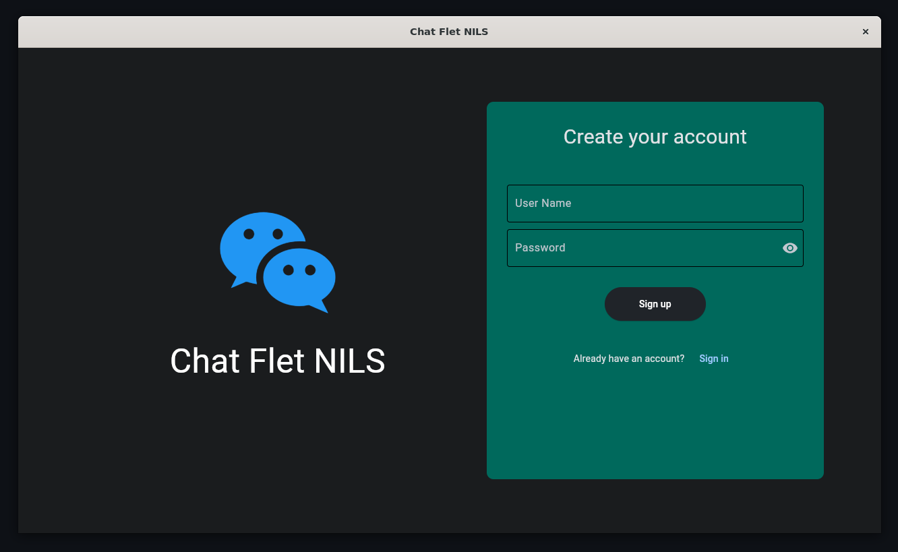

#  chat-bot - Chat Bot and Web Scraper

[](https://github.com/ThomasByr/chat-bot/blob/master/LICENSE)
[](https://GitHub.com/ThomasByr/chat-bot/commit/)
[](https://gitHub.com/ThomasByr/chat-bot/commit/)
[](https://GitHub.com/ThomasByr/chat-bot/graphs/commit-activity)

[](https://github.com/ThomasByr/chat-bot/actions/workflows/python-package.yml)
[](https://github.com/ThomasByr/chat-bot/releases/)
[](https://github.com/ThomasByr)
[](https://github.com/Bas6700)
[](https://github.com/LouiseCouture)

1. [✏️ Setup](#️-setup)
2. [🔧 Usage](#-usage)
3. [🧑‍🏫 Contributing](#-contributing)
4. [⚖️ License](#️-license)
5. [🔄 Changelog](#-changelog)
6. [🐛 Bugs and TODO](#-bugs-and-todo)
7. [🎨 Logo and Icons](#-logo-and-icons)

## ✏️ Setup

> <picture>
>   <source media="(prefers-color-scheme: light)" srcset="https://raw.githubusercontent.com/Mqxx/GitHub-Markdown/main/blockquotes/badge/light-theme/info.svg">
>   
> </picture><br>
>
> Please note we do not officially support Windows or MacOS, but we do provide some instructions for those who want to use it on these platforms.

You do not explicitly need a conda environment for the bot to run. But it is always recommended nontheless, especially because the next LTS of Ubuntu won't let users pip-install anything without a virtual environment. At the time of writing, this app `python >= 3.10` to run.

First, install the dependencies :

```bash
sudo apt-get update
sudo apt-get install libgtk-3-0
sudo apt-get install libgstreamer1.0-dev libgstreamer-plugins-base1.0-dev libgstreamer-plugins-bad1.0-dev gstreamer1.0-plugins-base gstreamer1.0-plugins-good gstreamer1.0-plugins-bad gstreamer1.0-plugins-ugly gstreamer1.0-libav  gstreamer1.0-tools gstreamer1.0-x gstreamer1.0-alsa gstreamer1.0-gl gstreamer1.0-gtk3 gstreamer1.0-qt5 gstreamer1.0-pulseaudio
```

Then clone the repository and cd into it :

```bash
# Clones the repository
git clone <your-repository-url>
cd <your-repository-name>
```

You can create and activate a conda environment with the following commands (make sure to give it a name in [environment.yml](environment.yml)) :

```bash
# Creates environment and install dependencies
conda env create -f environment.yml -y
conda activate sda
```

Finally, run the app in the background with `nohup` and `tee` :

```bash
# Runs the app in the background
nohup python main.py 2>&1 | tee -a .log &
```

or in the foreground :

```bash
# Runs the app (lets you Ctrl+C to stop it)
python main.py
```

## 🔧 Usage

Simply sign-in or sign-up to the app, and you will be able to chat with the bot and even chat with other users connected to the same server ! The bellow screenshots are from the desktop version, with WSL2 and Ubuntu 22.04.

| Sign In                              | Sign Up                              | Home Page                            |
| ------------------------------------ | ------------------------------------ | ------------------------------------ |
|  |  |  |

## 🧑‍🏫 Contributing

If you ever want to contribute, either request the contributor status, or, more manually, fork the repo and make a pull request !

We are using [black](https://github.com/psf/black) to format the code, so make sure you have it installed and run :

```ps1
black src
```

> The standard procedure is :
>
> ```txt
> fork -> git branch -> push -> pull request
> ```
>
> Note that we won't accept any PR :
>
> - that does not follow our Contributing Guidelines
> - that is not sufficiently commented or isn't well formated
> - without any proper test suite
> - with a failing or incomplete test suite

Happy coding ! 🙂

## ⚖️ License

> <picture>
>   <source media="(prefers-color-scheme: light)" srcset="https://raw.githubusercontent.com/Mqxx/GitHub-Markdown/main/blockquotes/badge/light-theme/warning.svg">
>   
> </picture><br>
>
> This repository is a template. Working source code is licensed under AGPL, the rest is unlicensed. If you whish not to use source code, please use the license of your choice. The following license only applies to the template itself and is not legal advice. <FONT COLOR="#ff0000"><u>The license of this repo does not apply to the resources used in it.</u></FONT> Please check the license of each resource before using them.

This project is licensed under the AGPL-3.0 new or revised license. Please read the [LICENSE](LICENSE.md) file. Additionally :

- Redistributions of source code must retain the above copyright notice, this list of conditions and the following disclaimer.

- Redistributions in binary form must reproduce the above copyright notice, this list of conditions and the following disclaimer in the documentation and/or other materials provided with the distribution.

- Neither the name of the chat-bot authors nor the names of its contributors may be used to endorse or promote products derived from this software without specific prior written permission.

```LICENSE
chat-bot - Chat Bot and Web Scraper
Copyright (C) 2023 Thomas BOUYER, Louise COUTURE & Bastian NADLER

This program is free software: you can redistribute it and/or modify
it under the terms of the GNU Affero General Public License as published by
the Free Software Foundation, either version 3 of the License, or
(at your option) any later version.

This program is distributed in the hope that it will be useful,
but WITHOUT ANY WARRANTY; without even the implied warranty of
MERCHANTABILITY or FITNESS FOR A PARTICULAR PURPOSE. See the
GNU Affero General Public License for more details.

You should have received a copy of the GNU Affero General Public License
along with this program. If not, see <http://www.gnu.org/licenses/>.
```

## 🔄 Changelog

Please read the [changelog](changelog.md) file for the full history !

<details>
  <summary>  alpha (click here to expand) </summary>

**v0.1** first public release

- create home page with flet (flutter)
- signin and signup pages, local user database with YAML and md5

</details>

## 🐛 Bugs and TODO

**TODO** (first implementation version)

**Known Bugs** (latest fix)

## 🎨 Logo and Icons

Unless otherwise stated, all icons and logos are made by the author.
Copyright (C) 2023 Thomas BOUYER, all rights reserved.

Tools used :

- [Microsoft Designer](https://designer.microsoft.com/)
- [Clip Studio Paint](https://www.clipstudio.net/en)
- [Canva](https://www.canva.com/)
